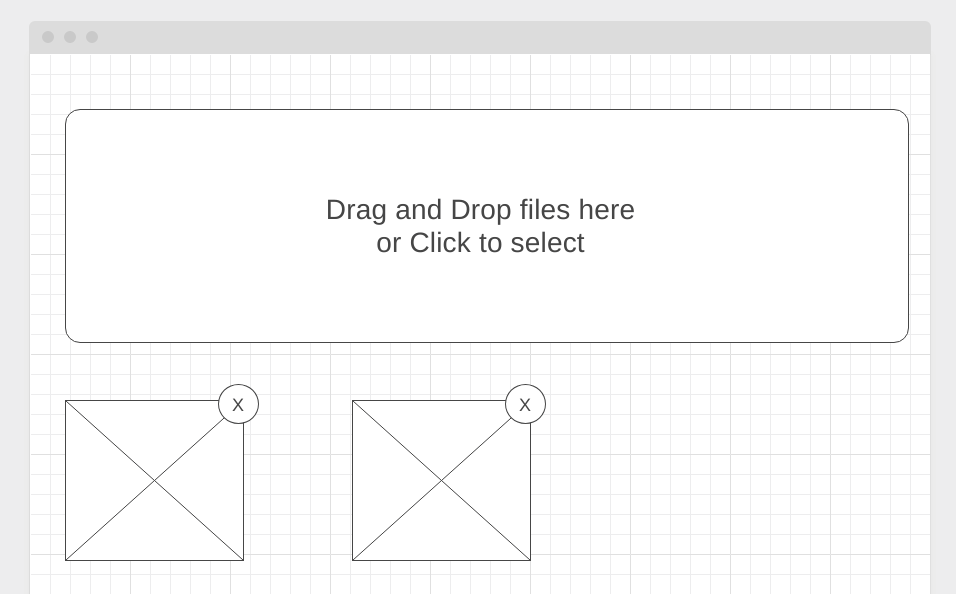

deployment:

### Modern Image Manager

#### Легенда

Менеджер картинок нуждается в улучшении. Решили сделать две вещи:
1. Предоставить возможность загружать пользователю изображения с его компьютера, а не URL.
2. Совместить форму для Drag'n'Drop и окошко выбора файлов.

#### Описание

Внешний интерфейс должен выглядеть так:

Схема работы:
1. При переносе изображения (Native DnD) с компьютера пользователя в блок Drag'n'Drop — т. е. из файлового менеджера переносим файл в окно браузера. Должна происходить загрузка файла, если это изображение, и отображение его внизу — превью с крестиком.
1. При клике на блок Drag'n'Drop должна открываться стандартная форма выбора файлов, как для native `<input type="file">`. После выбора файла также должна происходить загрузка с отображением его внизу — превью с крестиком.

Нужно, чтобы если пользователь два раза подряд выбрал один и тот же файл, неважно каким способом, этот файл оба раза загрузился и отображался внизу в превью. То есть их должно быть два.

